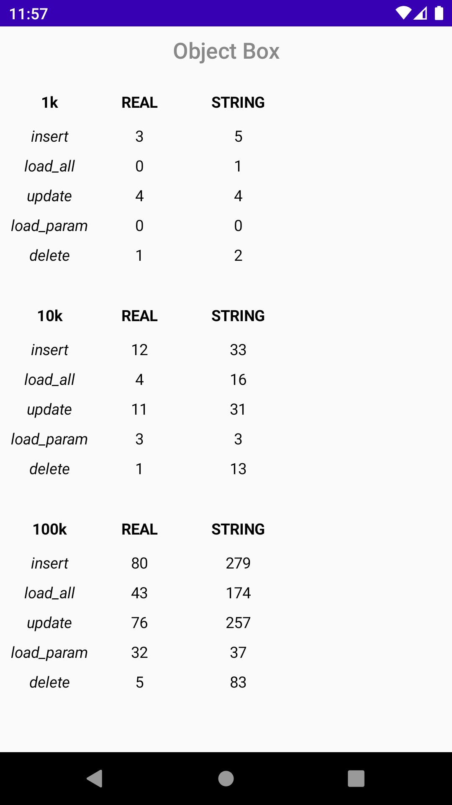
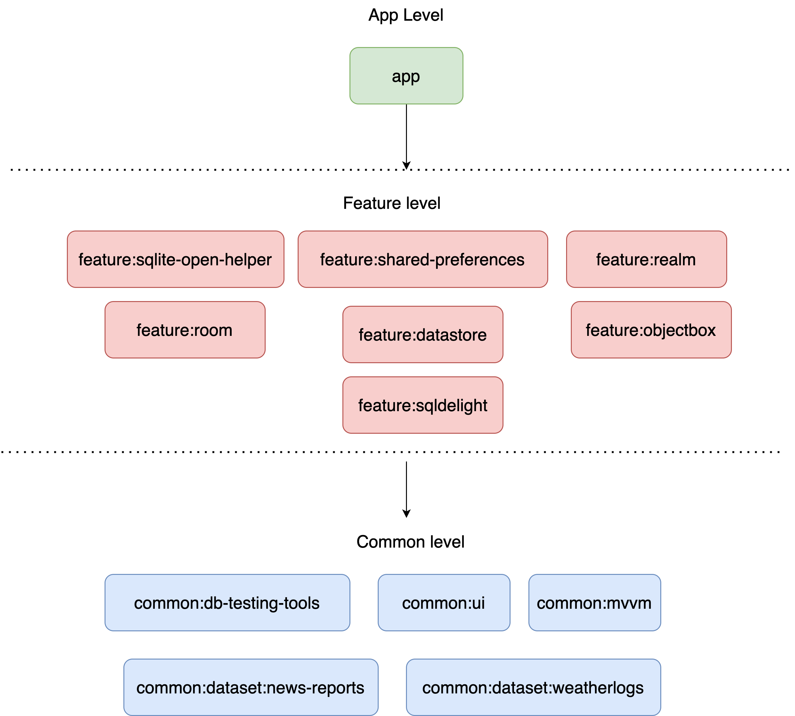
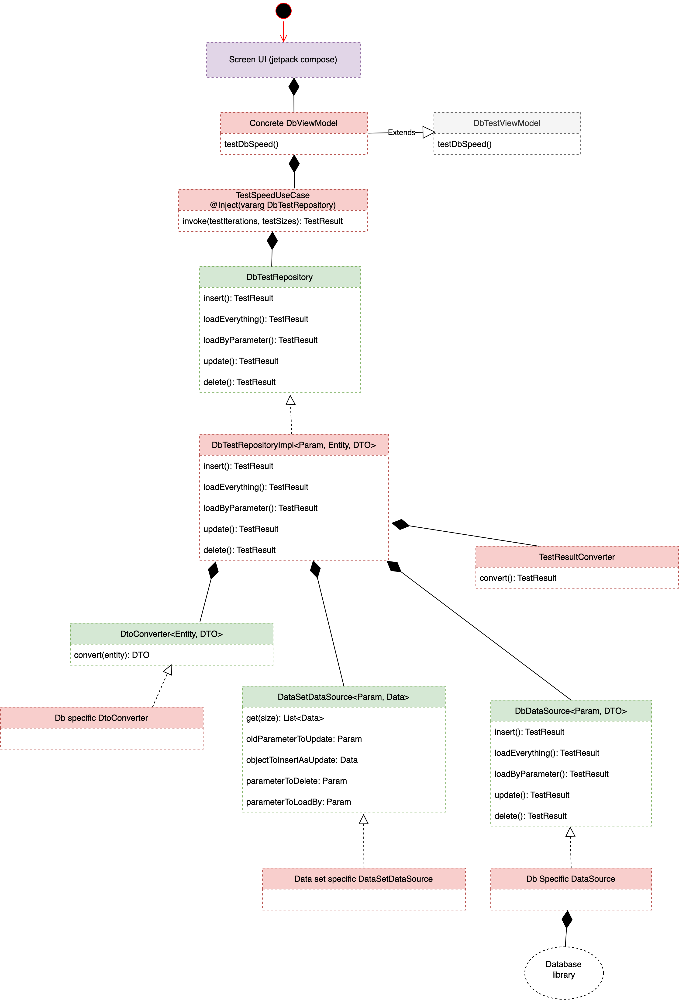

# Databases speed comparison for Android

This project compares **performance** of various **database** libraries for **Android**.

**Libraries tested:**
* [ObjectBox](https://objectbox.io) (NoSQL, object-oriented, non-relational)
* [Realm](https://realm.io/realm-kotlin) (NoSQL, object-oriented, non-relational)
* [Room](https://developer.android.com/training/data-storage/room) (SQL ORM)
* [SQLDelight](https://cashapp.github.io/sqldelight) (SQL ORM)
* [SqliteOpenHelper](https://developer.android.com/reference/android/database/sqlite/SQLiteOpenHelper) (SQL)
* [SharedPreferences](https://developer.android.com/reference/android/content/SharedPreferences) (NoSQL, key-value storage)
* [DataStore Proto](https://developer.android.com/topic/libraries/architecture/datastore#proto-datastore) (NoSQL, protobuf storage)

## Data sets
For now there are two data sets:
* **1) Floating numbers** (high uniqueness) - see [common/dataset/weatherlogs](common/dataset/weatherlogs/src/main/java/dev/konnov/common/dataset/weatherlogs/data/datasource/WeatherLogDataSetDataSource.kt)
* **2) Strings** (almost no uniqueness) - see [common/dataset/news-reports](common/dataset/news-reports/src/main/java/dev/konnov/common/dataset/newsreports/data/datasource/NewsReportDataSetDataSource.kt)

## Project structure
The project is divided into **three types of modules**:
* **app** - main screen and Application class.
* **feature** - logic for testing a particular database
* **common** - code shared between the modules

To structure the code itself, **clean architecture** is used. With the only classes being different across the features are **DtoConverter** and **DbDataSource** on the **data layer**. 
This means if you want to add a performance test for a new database, all you have to do is create your own implementation of these two classes.

## Tech stack
This project utilizes the latest Android technologies, such as:
* [Jetpack compose](https://developer.android.com/jetpack/compose)
* [Dagger Hilt](https://dagger.dev/hilt/)
* [ViewModel](https://developer.android.com/topic/libraries/architecture/viewmodel)
* [Navigation Component](https://developer.android.com/guide/navigation/navigation-getting-started)
* [Kotlin Coroutines](https://kotlinlang.org/docs/coroutines-overview.html)
* [Gradle version catalog](https://docs.gradle.org/current/userguide/platforms.html)